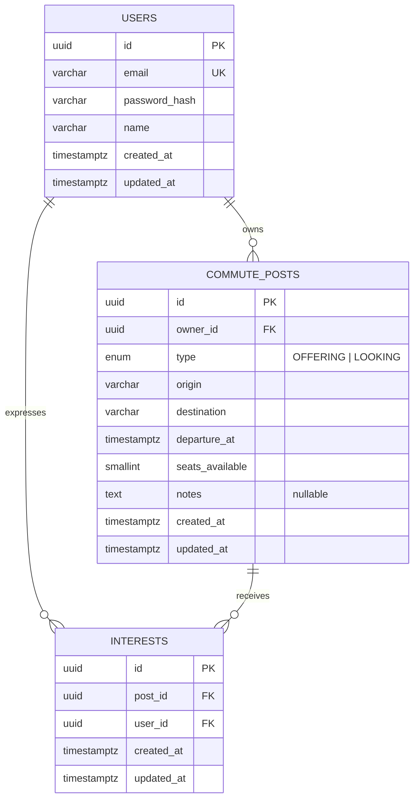

# Database schema

Three tables, all owned by TypeORM migrations (`backend/src/database/migrations`) — `synchronize` is
always off, so this file and the migration are the source of truth, not whatever the ORM happens to infer.

## Notes on the design

- **Primary keys are app-generated UUIDs** (`node:crypto randomUUID()` in a `@BeforeInsert` hook on a
  shared `BaseEntity`), not database-generated defaults. This avoids depending on the `pgcrypto` /
  `uuid-ossp` extension being enabled on whatever managed Postgres the app ends up on (Neon/Supabase/
  Railway all differ slightly here) — one less thing that can silently fail in production.
- **`interests` has a unique constraint on `(post_id, user_id)`** — the database itself refuses a
  duplicate "I'm interested," not just the service layer. The service layer still checks first so the
  user gets a clean 409 with a message instead of a raw constraint-violation error.
- **Cascading deletes**: deleting a post removes its interests; deleting a user removes their posts and
  interests. There's no "soft delete" — out of scope for this assignment, called out in the README's
  "what I'd do differently."
- **`type` is a real Postgres enum**, not a string with app-level validation only — the two are meant to
  stay small and fixed (`OFFERING` / `LOOKING`), so the database enforces it too.
- Indexes on `origin`, `destination`, and `owner_id` on `commute_posts`, and on `post_id`/`user_id` on
  `interests` — these are exactly the columns the API filters/joins on (search-by-origin-or-destination,
  "my posts," "who's interested in this post").
